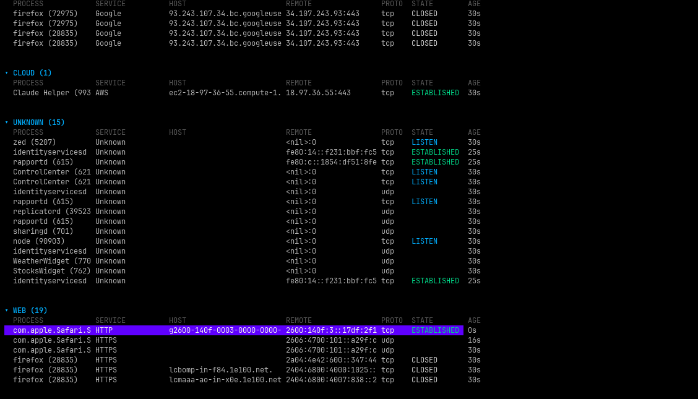
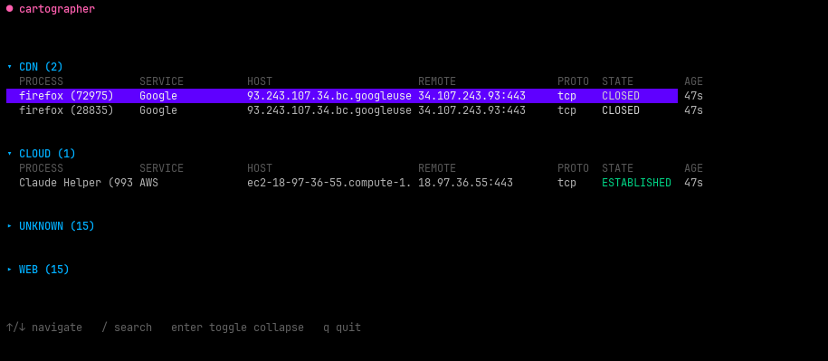

# Cartographer 🗺️

> See exactly what your Mac is doing on the network — and why.


<!--*(Screenshot 1 — full expanded UI showing CDN / Cloud / Web / Unknown categories)*-->


<!--*(Screenshot 2 — collapsed overview showing category counts)*-->

---

## What it is

Cartographer is a terminal tool that shows you every active network connection on your Mac, mapped to the process that owns it, enriched with context about what each connection actually is.

Instead of staring at raw IP addresses, you see:

```
Chrome      → Google CDN          (HTTPS)
Slack       → AWS us-east-1       (HTTPS)
VS Code     → telemetry server    (HTTPS)  ← you might not have known this
postgres    → localhost           (DATABASE)
```

It updates live, every two seconds. New connections flash briefly so you notice them. When a connection closes, it disappears.

---

## The problem it solves

Your Mac is constantly talking to the internet. Every app you run — your editor, your browser, your chat tool, background services — is opening network connections. You have no idea what most of them are.

`lsof` and `netstat` exist, but their output is dense, raw, and doesn't refresh. They tell you an IP and a port. They don't tell you *what it is* or *why it's there*.

Cartographer answers the question: **what is my machine actually doing right now?**

---

## How it works — the pipeline

Every two seconds, Cartographer runs through four stages:

### 1. Collect
Runs `lsof -i` under the hood — a tool pre-installed on every Mac that lists open files, including network sockets. Parses the output into structured connection records: which process, which local port, which remote IP and port, what TCP state.

### 2. Resolve
Takes each raw remote IP address and looks up its hostname via reverse DNS. `142.250.80.46` becomes `lga34s32-in-f14.1e100.net`. Results are cached so DNS isn't hammered on every poll.

### 3. Classify
Figures out what each connection actually is through two layers:

- **Rule-based first** — well-known ports and hostname patterns. Port 5432 is always Postgres. A hostname ending in `amazonaws.com` is AWS. This is fast and handles most connections instantly.
- **AI fallback** — for anything the rules can't identify, sends the process name + hostname + port to Gemini and asks it to classify. Results are cached to a local file so the same unknown host is only ever classified once.

### 4. Render
Displays everything as a live-updating table in the terminal using Bubbletea — a Go library for building terminal UIs. Columns are aligned, headers are styled, connections are grouped by category, and new connections are highlighted briefly so nothing slips by unnoticed.

---

## Code structure

| Package | Responsibility |
|---|---|
| `collector` | Runs `lsof`, parses raw output into `Connection` structs |
| `resolver` | Reverse DNS lookups with a local cache |
| `classifier` | Port rules + hostname patterns + Gemini for unknowns |
| `graph` | Holds current connection state, diffs new vs old |
| `tui` | Bubbletea terminal UI, poll loop, rendering |

---

## Why these technology choices

**Go** — concurrency is built in. The poll loop, DNS lookups, and AI calls all run in goroutines without complexity. Compiles to a single binary with no runtime needed.

**lsof** — pre-installed on every Mac, no special permissions needed for most connections, gives exactly what we need: process and network info together.

**Bubbletea** — the standard for terminal UIs in Go. Uses the Elm architecture (Model → Update → View), which makes state management clean. Handles terminal resizing, keyboard input, and rendering.

**Reverse DNS** — faster and more reliable than IP geolocation lookups. Most cloud providers have meaningful reverse DNS records (`ec2-52-x-x-x.compute-1.amazonaws.com` tells you it's AWS immediately).

**Rule-based classifier first, AI second** — rules are instant and free. AI is slow (100–500ms) and costs money. The vast majority of connections hit the rules. Gemini only fires for genuinely unknown hosts, and results are cached permanently so each unknown host is classified exactly once.

---

## What it is not

- Not a security tool — it doesn't block connections or alert on threats
- Not a packet inspector — it doesn't look at the content of connections
- Not a firewall — it only observes, never interferes
- Not Linux-compatible — uses macOS-native tools (`lsof` behaves differently on Linux)

---

## Build order

The project is built in phases, each producing something runnable:

1. **Foundation** — parse `lsof` output, print a raw table to stdout. Proves the data pipeline works.
2. **Enrichment** — add DNS resolution and the classifier. Raw IPs become meaningful labels.
3. **TUI** — replace stdout with a live Bubbletea interface. The visual layer.
4. **AI layer** — add Gemini classification for unknowns. The intelligence layer.
5. **Polish** — diff detection (new/closed connections), README, demo GIF, ship.

The principle: always have something runnable. Each phase adds one layer on top of something already working.

---

## Status

> 🚧 **Work in progress** — service detection coverage is being expanded (more CDN providers, cloud vendors, and self-hosted services), and the UI is being refined for clarity and usability. Contributions and feedback are welcome.

---

## Usage

```
cartographer
```

No config, no setup, no daemon. A single binary — run it anywhere on your Mac and see your machine's entire network activity, live, with context.
